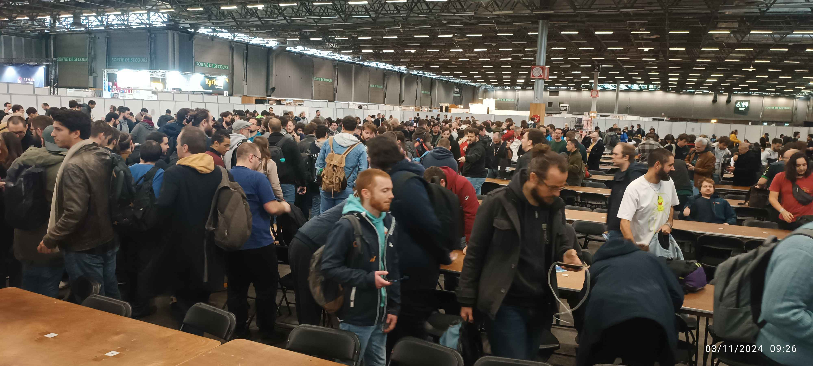

# Report Villepinte Novembre 2024
> [!WARNING]
> Je n'aborde majoritairement que les éléments pouvant figurer dans un rapport d'étonnement, ce qui pourrait paraître majoritairement négatif, le constat est encore meilleur que l'évènement d'Angers. Je n'aurais aucun problème à vouloir refaire un évènement comme celui-ci.

## Résumé

|||
|---|---|
|Constat|***Très positif***|
|Date|02 et 03 Novembre 2024|
|Nombre de joueur|496/512|
|Arbitres| 2 équipes au Floor (1 Team Lead + 5 Floor Judge)|
|Nombre de ronde|9 rondes de 30 minutes|
|Top| Top 16 (initialement annoncé à Top 8)
## Samedi 02 Novembre 2024
*Rien à dire, je n'étais pas présent ce jour*
## Dimanche 03 Novembre 2024
### Remarques Pré-Journée
Proposer de refaire un point règle est une bonne idée, celui-ci ayant été suffisament proche de l'évènement, les informations abordées étaient encore un minimum fraîche dans la tête.
### Début de la journée et arrivé sur site
Ayant reçu un message annonçant l'heure de regroupement sur la venue à 7h30, le temps de RER necessaire pour arriver sur site et la présence jusque tard de la famille à la maison, j'ai pris la décision de ne pas dormir la veille, et ais pris le train de 5h11 à côté de chez moi. Dans la précipitation, j'ai oublié de prendre les *Energy Drinks* permettant un petit coup de fouet en cas de besoin.
> [!NOTE]
> Je me le répète à chaque fois, mais le sac doit être intégralement prêt **et posé à côté du frigo** afin de ne pas oublier ce que j'ai à prendre.

Arrivé sur site, au alentour de 7h00, je ne disposais que de peu d'informations, la sécurité du Parc a été en mesure de me renseigner.

> [!TIP]
> Une petite fiche ou un message Discord résumant le necessaire pour rejoindre le site et le necessaire afin d'accéder à la zone serait un plus. Impossible de deviner nous même que nous pouvions utiliser la porte automatique situé à proximité des entrée clients/joueurs.

Nous avons profité du moment de repis pour faire un peu connaissance, discuter un peu et faire un peu d'ordre dans la zone de jeu.
Petit briefing pré-ouverture de Wadie et Maverick afin de faire le point sur les rulings dont nous avions discuté le vendredi précédent, nous souhaiter un bon évènement et reparler des points important à garder à l'esprit. 

> [!NOTE]
> **Un très gros plus** qui m'a l'air d'avoir plus globalement plus aux équipes.
> Passer d'une simple communication via le Discord à un échange pré-évent permet aussi de casser un peu la glace et ne pas rester sur les premières impressions qu'on aurait pus avoir via le Discord.

Se rassembler comme ça donne un peu plus l'impression d'appartenir à une équipe et non à être uniquement un élément isolé.  
Petit tour rapide en équipe pour voir notre *floor* et l'évènement pouvait commencer.
> [!NOTE]
> La zone de jeu m'a semblé plus adapté qu'à Angers, il y avait certe deux fois moins de joueurs mais il était plus facile de circuler en utilisant les extérieurs.

> [!WARNING]
> Pour les pancarte en bout de table, indiquer le tables en tenant compte de l'orientation de la rangé serait un gros plus.
> ***Ex.***: Si en lisant la pancarte, je vois *16 à 10*, je sais que la table la plus proche est la table n°16  

### [Main Event] Rondes

> [!NOTE]
> **Utilisation de logiciel**
> La mise en place du combo ***Melée / PurpleFox*** est une excellente nouvelle, les inter-rondes ont été plus fluide et la prise en charge des tables lors du temps additionnel a été beaucoup plus fluide

Excellent retour des joueurs concernant les périodes entre les rondes. Pas grand chose à redire là dessus excepté que c'est vraiment que du bon et que ça fait du bien à l'image de l'évènement.  

Nous avons eut quelques couacs concernant la communication faites aux joueurs concernant une pause repas ou non, ceci ayant entrainé des *no-show* où il a fallus gérer la frustration des joueurs écopant *de facto* d'une défaite sur une évent où ils n'avaient pas de défaite.
> [!TIP]
> Quelques communications pour préciser le dérouler de l'évènement, peut être la présence d'un "*programme prévisionnel*" sous forme de quelques affiche, même papier, présente aux tables staff et/ou mur.
> **A méditer**: Vus la taille des surface affichant le chrono, il aurait peut être été possible d'afficher les informations importantes sur une portion de l'écran.

**Gros plus**: Le fait que la zone arbitrale ait vue sur l'évènement et que les repas soient disponible dès l'heure de manger était un très gros plus et nous ont permis de faire une pause sereinement tout en restant disponible en cas de soucis pour les collègues.

#### Erreur de rulings ?
J'ai été confronté à une demande de ruling concernant un oublie de pioche.  
**Remise en contexte**: Deux joueurs m'appellent concernant un oublie de pioche au crépuscule, la partie est désormais au matin.
En arrivant, je demande aux deux joueurs de me résumer la situation, les deux sont d'accord sur la situation, le board-state.  
Après avoir vérifier les cartes présentes en expédition, en réserve et en défausse, je ne constate aucun élément me permettant de penser que des informations auraient été gagné entre le moment où la pioche aurait dus être faites et le moment actuel.  
En constatant un écart sur le nombre de mana entre les deux, je demande au joueur concerné (Joueur A) s'il a déjà annoncé sa mise en mana ou non, auquel j'obtiens une réponse négative.  
Sans élément informations supplémentaire gagné de la part du joueur *fautif*, je lui demande de prendre sa carte en main et demande aux deux joueurs si la situation est bien Ok pour eux, j'obtiens une réponse affirmative des deux joueurs. J'ai tout de même la sensation que le second joueur (Joueur B), n'est pas entièrement convaincus, mais celui-ci ayant indiqué que la situation était Ok, je n'insiste pas plus, au final il faudra ajouter 2min au chrono, l'investigation ayant pris un peu de temps.  
**Questionnement**: J'apprends post-ronde que le joueur avait mis une carte en mana, mais l'avait repris en main avant l'appel (backup simple rentrant dans le cadre de ce que les Game Designer nous avaient demandé, à savoir être tolérant), aucune information n'ayant été gagnée. Le joueur B, ayant finalement perdu sa partie étant un peu frustré, il est revenus en parler de manière cordiale, nous avons échangé. J'admet que j'ai pus faire une erreur, même si en repassant le scenario dans ma tête au calme, je n'arrive pas à isoler un élément qui aurait pus me faire dévier du ruling rendus. On est sur une erreur de séquence, mais au moment de prendre les première décisions, le joueur a bien en main les cartes qu'il aurait dû avoir.
> [!NOTE]
> Penser à bien indiquer aux joueurs si ceux-ci paraissent dubitatifs qu'il peuvent faire appel de la décision auprès d'un Head Judge.

### Quelques notes en passant
Nous envoyer quelques arbitres YGO afin de nous aider à canaliser les joueurs afin de ne pas géner les couloirs et l'horloge de ronde partait d'un bon sentiment, mais j'ai tout de même eut l'impression d'avoir à faire à deux cow-boy qui ont viré assez sèchement les joueurs.  
Mention spéciale à la judge qui a essayer de faire bouger Maverick en mode "*rien à fiche* de qui tu es"...
> [!NOTE]
> Vus qu'il sont venus se présenter à moi pour se présenter faire un rappel sur le côté bienveillant de notre rôle sur l'évent n'aurait pas été du luxe.
> J'avais déjà été avertis de la propention des arbitres à faire les cow-boy, mais je pensais qu'il s'agissait, comme souvent, d'exagération des joueurs.

### Fin des rondes qualificatives au Top et débriefing
La fluidité des inter-rondes, que ce soit par le travail fournis par l'équipe et l'utilisation de logiciels adapté nous a permis de finir assez tôt.  
Une fois la dernière ronde terminé, nous nous sommes retrouvé pour débriefer tranquilement. Un gros merci à Wadi qui a pris le temps de venir nous remercier et nous glisser quelques paroles sympa pour clore tout ça, le sentiment d'avoir fait tout ça en équipe.  
Wadie fait également les annonces pour les personnes arbitrant le Top 16. J'apprend (en même temps que les autres :P), que je prends le Lead sur l'équipe.  
Nous préparons la surface de jeu et prenons un peu de repos avant que ça commence.
> [!NOTE]
> Je n'avais pas postuler pour du Team Lead, mais j'en avais parlé avec Thomas lors de notre debriefing d'Angers.
> Vus qu'il était là pour Villepinte en Team Lead *Volant*, je suppose que lui et Antoine en ais parlé à Wadie.
> Wadie, Thomas ou Antoine, si vous lisez ceci, merci je penses que je me serais jamais sentis prêt si on m'avait pas "*jeter sous le camion*".

## Top 16
Petite subtilité pour ce Top 16, avec la présence d'une *Feature Table*, c'est Maverick qui va l'arbitrer, je perds donc mon filet de sécurité pour les reflections ou les investigations un peu. Au final, pas un problème, ça m'obligera à moins douter de mes décisions.
Pas énormement de chose à dire, ça semble s'être bien passé, j'attends d'avoir l'occasion de débriefer un coup avec Wadie, si c'est possible.
> [!NOTE]
> Penser à éditer le rapport si j'arrive à avoir du retour.

### Play Team & Rollback, le Ruling difficile
Lors d'une des parties, un membre de la play team qui observait la table demande à parler à l'arbitre surveillant la table.  
Après avoir discuté avec l'arbitre surveillant la table, celui-ci m'appel et nous résume la situation.  
Le membre de la playteam est catégorique, un personnage a été rejoué pour la troisième fois, donc la seconde fois de la réserve.  
Wadie arrivant à la table, la situation est expliqué, les joueurs n'étant pas certain qu'il n'y a pas eut erreur et la personne de la playteam étant certain à 99%, Wadie me demande de prendre une décision en terme de ruling.  
Pressé de prendre une décision, j'omet de peser quelques points qui auraient dû être pris en compte et décide d'envoyer le personnage en défausse et de rembourser le mana.  
A postériori, le joueur n'ayant pas commis l'erreur nous indique que ce Roleback lui a probablement coupé la game.
> [!TIP]
> Réagir sur le constat de la Playteam était une bonne chose, néanmoins les deux joueurs n'avaient pas remarqué là chose, et une fois le fait ennoncé, les deux avaient tout de même des doutes. Ca aurait dû être un redflag concernant le besoin de se poser deux secondes avant de rendre un ruling.

> [!NOTE]
> C'est une erreur de ma part, j'aurais dû lever le crayon et m'intéroger sur les impacts que ce ruling provoquait sur la partie.
> J'ai un peu le sentiment que le joueur ayant fait une erreur a gagné un avantage ce coup-ci.

### Résumé & Remerciement
En dehors de ce ruling tout s'est, de moins point de vus, passé correctement.  
Départ un peu avant 21h pour rentrer à la maison, la journée aura bien été remplis.

Encore un gros merci à toute l'équipe avec qui j'ai passé un super moment.  
Mention spéciale à Wadie, Antoine, Maverick et QC qui ont supporté mes questions, ça me permet d'étoffer encore plus mes connaissances/compétences.  
Très gros big up à l'équipe du Floor A pour votre bonne humeur et pour la journée passé ensemble.